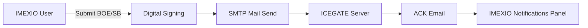

# 👋 Hi, I'm Sebastian Dias  

💡 A Business Analyst & Tech Enthusiast passionate about bridging **business processes** with **tech-driven solutions**.  
⚡ Experienced in building and enhancing modules for **IMEXIO**, a trade & customs management platform in India.  

---

## 🚀 About Me  
- 🧑‍💻 4+ years of experience in **Business Analysis & Operations**  
- 🌐 Worked on **IMEXIO**, handling modules like:
  - Registration  
  - Payments  
  - Bill of Entry (BOE)  
  - Shipping Bill (SB)  
  - Notifications & Email Integration (SMTP/SignalR)  
  - User Access & Role Management  
  - API  
  - Master Management for Users  
  - Reports  
  - RoDTEP/Drawback Calculations  
- 🎯 Skilled in **requirement gathering, system design, and process optimization**  
- 📊 Exploring **ERP (SAP S4HANA)** and **Supply Chain Tech** for hybrid career growth 

---

## 🛠️ Tech & Tools  
  
  
  
  

---

## 📌 IMEXIO Modules Showcase  

### 🔹 Key Modules  

### 🔹 Email SMTP Flow (BOE/SB to ICEGATE)

sequenceDiagram
    participant U as User
    participant I as IMEXIO
    participant S as SignalR
    participant E as Email Service

    U->>I: Submit to ICEGATE
    I->>S: Open SignalR Connection
    S->>E: Monitor Emails
    E-->>S: New Email Received
    S-->>U: Real-time Notification

🌱 Outside of Work
⚽ Footballer (occasional matches, weak ankle but strong spirit 💪)
🏃 marathons - Completed 3 × 10K and 1 × 15K. Preparing for 21K
☕ Coffee lover (Americano all the way)
📚 Currently reading Object-Oriented Design & Analysis by Grady Booch
